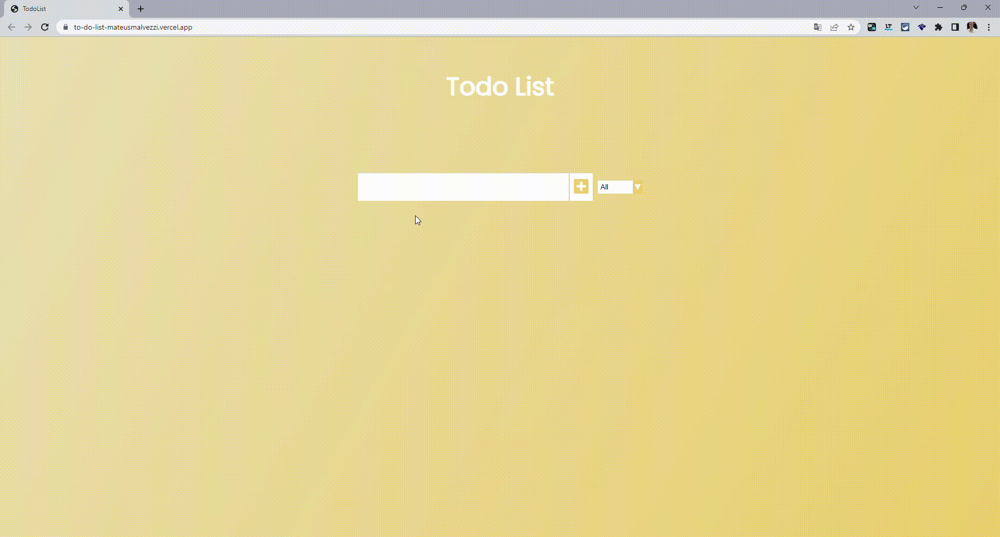

<h1 align="center">
  🚀 To-Do List!
</h1>

  
  
  

  

  <a href="#page_with_curl-about">About</a>&nbsp;&nbsp;&nbsp;|&nbsp;&nbsp;&nbsp;
  <a href="#wrench-built-with">Built With</a>&nbsp;&nbsp;&nbsp;|&nbsp;&nbsp;&nbsp;
  <a href="#-how-to-contribute">How to Contribute</a>&nbsp;&nbsp;&nbsp;|&nbsp;&nbsp;&nbsp;
  <a href="#memo-license">License</a>

 

 ## Demonstration
  

    
    

## :computer: Live Preview

You can access this website demo version at the following link [Demo Version](https://to-do-list-mateusmalvezzi.vercel.app/)

## :page_with_curl: About  
EN   Believing that every developer needs to code a todo list, here's mine. 
        The main objective is to study and practice functions and gift. I made some comments through the code and will add some relevant ones below. 
        I faced some obstacles with JS, but the documentation and Indians youtubers always save. 
        Next step is to:  
- Create a function to show the goals that were deleted.
- Leave it in the default mobile responsiveness, because today the project is only in the web standard (my monitor is 24 inches).    

PT-BR   Acreditando que todo desenvolvedor precisa codificar uma lista de tarefas, aqui está a minha.  
O objetivo principal é estudar e praticar funções e dom. Fiz alguns comentários através do código e adicionarei alguns relevantes abaixo. 
Enfrentei alguns obstáculos com JS, mas a documentação e os youtubers indianos sempre salvam.  
Os próximos passos são: 
- Criar uma função para mostrar as metas que foram excluídas.
- Deixar na responsividade padrão mobile, pois hoje o projeto está apenas no padrão web (meu monitor é de 24 polegadas).
  
## :page_with_curl: Some comments  
- The appendChild() → method of the Node interface adds a node to the end of the list of children of a specified parent node. If the given child is a reference to an existing node in the document, appendChild() moves it from its current position to the new position. 
- Child nodes → include elements, text and comments. The items in the collection of nodes are objects, not strings. To get data from node objects, use their properties. 
- The forEach() → method calls a function for each element in an array. The forEach() method is not executed for empty elements. 
- e.tagert.value → Is the value property of some DOM element, in this case that means the text entered in the search input.
- The preventDefault() → method cancels the event if it is cancelable, meaning that the default action that belongs to the event will not occur. For example, this can be useful when: Clicking on a "Submit" button, prevent it from submitting a form.
- Parent element → is read only property which returns the parent element of the selected element. The element object represents an HTML element, like P, DIV, etc. Return Value: The parentElement property returns an element object representing parent element if present or else it will return null.
  
## :wrench: Built With

- [JavaScript](https://developer.mozilla.org/en-US/docs/Web/JavaScript)
- [HTML](https://developer.mozilla.org/en-US/docs/Web/HTML)
- [CSS](https://developer.mozilla.org/en-US/docs/Web/CSS)
 
## 🤔 How to Contribute

- Clone the project: `git@github.com:MateusMalvezzi/ToDoList`;
- Create your branch with your feature: `git checkout -b my-feature`;
- Commit your feature: `git commit -m 'feat: My new feature'`;
- Push to your branch: `git push -u origin my-feature`.

After the merge of your pull request is done, you can delete your branch.
 
## :memo: License

This project is under the MIT license. See the [LICENSE](LICENSE.md) file for more details.

---

Made by <tr>
    <td align="center"><a href="https://github.com/MateusMalvezzi"><b>Mateus Malvezzi Rodrigues</b></a> </td>
  <tr>
